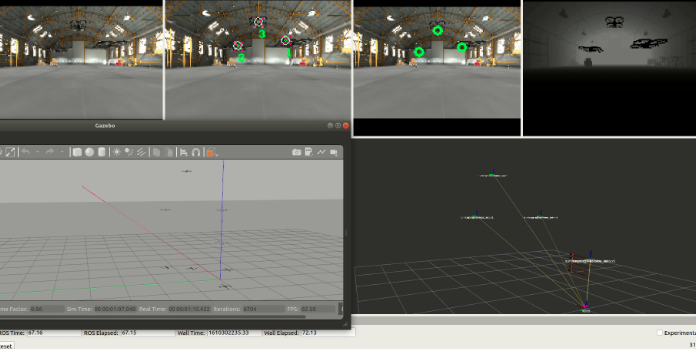

# Multi Agent Tracking 
Multi Agent Tracking for Data Association with various filter comparison

## Overview
This is ROS package developed for tracking multiple agents using a camera. This software is designed for associating 2D bounding box measurements (of drones) to unique IDs and 2D position in image space. The required inputs for this software are 2d bounding box measurements and RGB image. The provided outputs are 2D positions with target associations. The motion model is based on Gaussian Linear kalman filter with probabilistic hypothesis density (PHD) filter to solve association. Can also run Joint Probability Association filter (JPDAF) by switching rosparam upon launch. This repository includes matlab implementation and evaluation as well.    




**Developer: Mark Lee<br />
Affiliation: [NYU ARPL](https://wp.nyu.edu/arpl/)<br />
Maintainer: Mark Lee, ml7617@nyu.edu<br />**

#### Subscribed Topics
|Name|Type|Description|
|---|---|---|
|`/darknet_ros/bounding_boxes`|darknet_ros_msgs/BoundingBoxes|output 2D position from darknet ros pacackage|
|`/darknet_ros/detection_image`|sensor_msgs/Image|RGB image|

#### Published Topics
|Name|Type|Description|
|---|---|---|
|`/tracked_image`|sensor_msgs/Image|RGB with position, ID association labeled|

#### ROS Parameters
|Name|Description|
|---|---|
|`filter`|phd or jpdaf specify in the demo.launch file|


## Install
The tracking filter package is dependent on Eigen and Boost, and ROS. The additional repo can be installed below:

install darknet ros for 2d bounding box test (older version to be compatiable with rosbag data)
```
$ git clone https://github.com/ShiSanChuan/darknet_ros.git
$ cd ..
$ catkin_make darknet_ros -DCMAKE_BUILD_TYPE=Release
$ source devel/setup.bash
```

install filter repository into catkin directory
```
$ git clone https://github.com/arplaboratory/multi_robot_tracking.git
$ cd ..
$ catkin_make
$ source devel/setup.bash
```

retrieve rosbag data from [ARPL data folder](https://drive.google.com/drive/folders/1xc6DbgBbhABoLlvGTSrrJ1zFWL4S-ZTt?usp=sharing) after gaining access

## Running
This pacakge runs the tracking filter only -- it doesn't provide image detection. If image detection package is not available, can run with either by recorded rosbag data or by acquiring ground truth detection from simulation. Boths options are shown below. Specifiy filter rosparam in the demo.launch file to select phd or jpdaf filter. 

```
$ roscd multi_robot_tracking/launch/
$ roslaunch demo.launch
```

A. Running with recorded Rosbag. </br>
Move rosbag data into corresponding directory. Modify the rostopic subscriber in multi_robot_tracking_nodelet.cpp if wanting to modify using a different measured input.
```
$ roscd multi_robot_tracking/launch/
$ roslaunch demo.launch
-- open a new tab and navigate to rosbag directory
$ rosbag play darknet_detection_3drones_VICON_TobiiGlasses.bag 
```

B. Running with simulation. </br>
We can also utilize the Flightare simulator for photorealistic rendering to create new data. Refer to [Flightmare github page](https://github.com/uzh-rpg/flightmare) for installation and setting up dependencies. <br />
Running the below code launches Flightmare simulation with Gazebo for multiple drones, multimotion creates trajectories for all drones, and phd_tracker associates each target in space.
```
$ source ~/flightMare_sim_ws/devel/setup.bash
$ roscd flightros/launch/multi_tracking/
$ roslaunch multi_robot.launch 
-- open a new tab and navigate to rosbag directory
$ rosrun flightros multimotion
-- open a new tab and navigate to rosbag directory
$ roscd multi_robot_tracking/launch/
$ roslaunch demo.launch
```

C. Running Matlab for Evaluation
Move the corresponding rosbag data to the Matlab directory. Make sure the GM_PHD_Initialisation_drones.m file points to the correct directory for rosbag data. 

